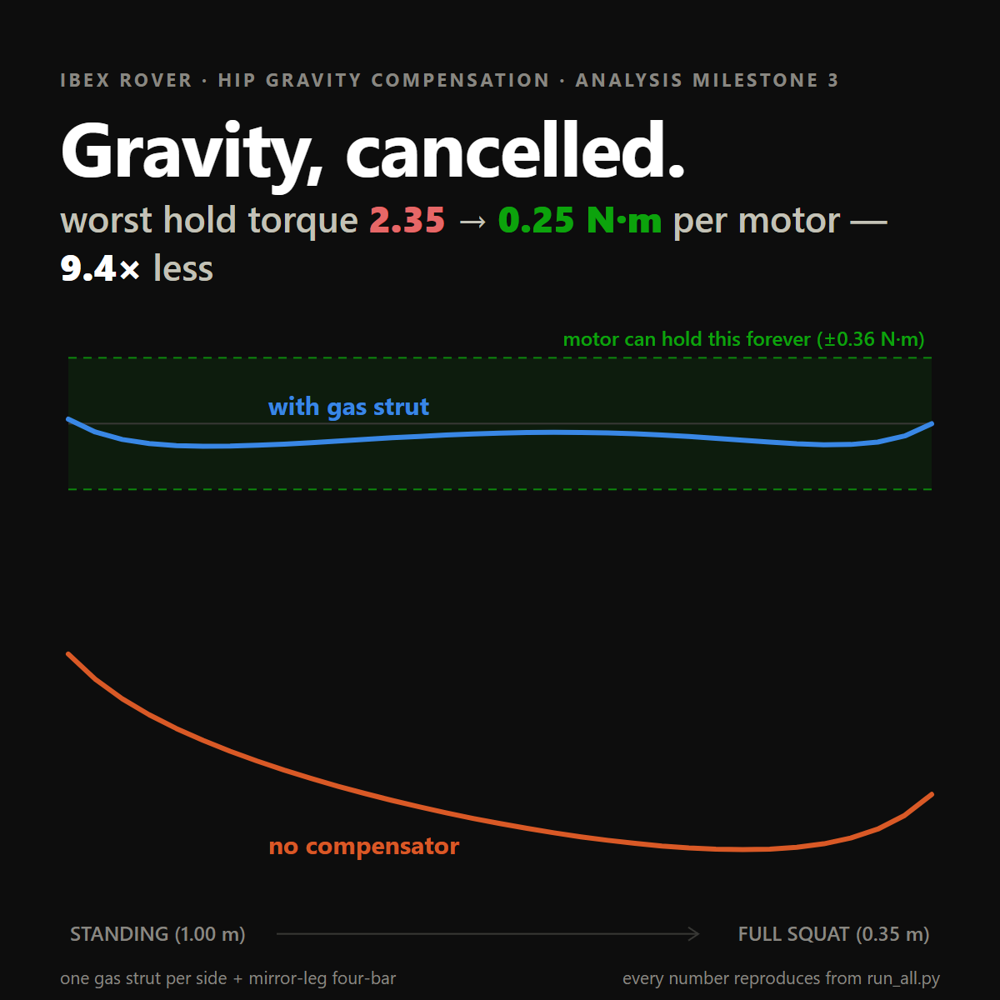
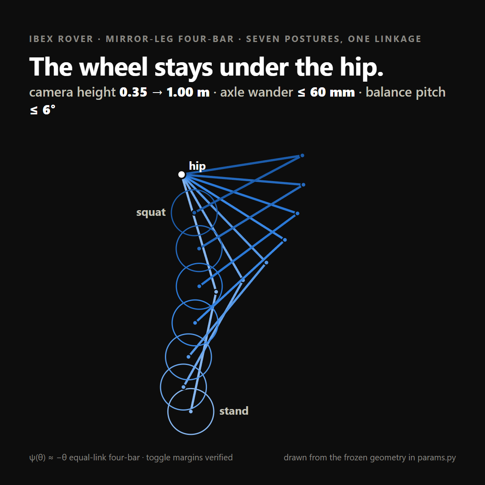
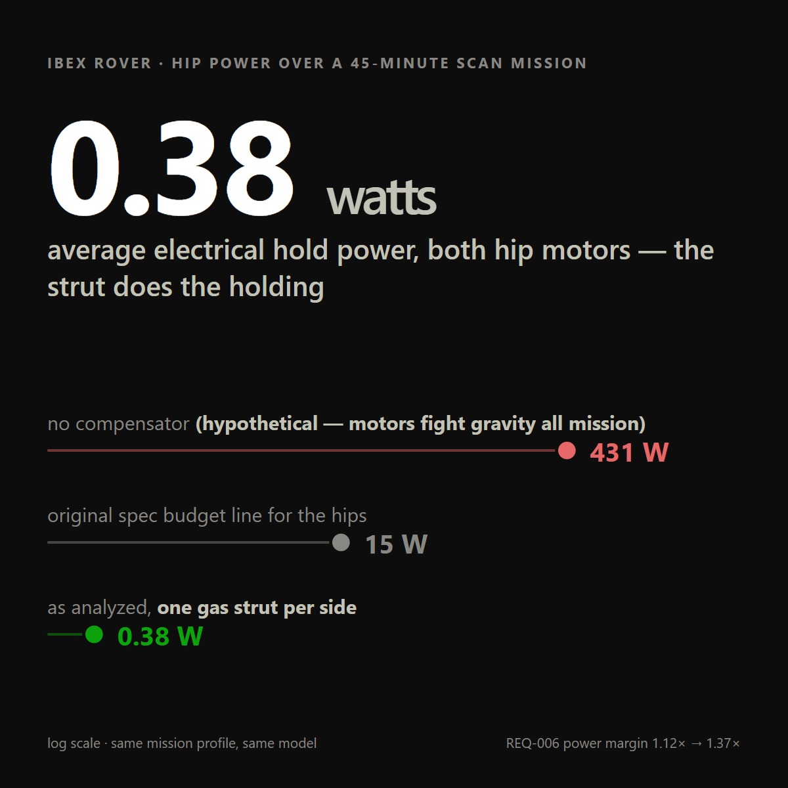

# Armature: robotics engineering plugin for Claude Code

Armature is a robotics engineering pipeline packaged as a Claude Code plugin.

AI has permeated every part of software engineering… but not so much in robotic design. 
As someone who dabbles in both, I felt like a suite for rapidly iterating on robotic concepts, 
creating SpecOps, and crunching the dynamics and kinematics with you was sorely missing.

Will this replace a mechanical engineer? Hell no. However, it will make your life a little easier 
and get past some of the monotony. I’ve found it extremely helpful for my own projects, and 
I think engineers deserve the beauty of Claude Code too.

Install it once, then run `/armature:init` in a blank folder. It'll scaffold a
standard project, stamp `CLAUDE.md`, and roll right into the pitch interview.
From there you work pitch → spec → plan → derive → CAD the way a real
engineering team would: budgets tracked, requirements traced, decisions
logged, and a red-team pass before anything gets built or bought.

## Where to go

| Your situation | Reach for |
|---|---|
| Blank folder, new robot idea | `/armature:init` |
| Not sure it's worth building, or for whom | `armature-pitch` |
| Pitch settled; need the engineering spec, a trade study, or a design review | `armature-spec` |
| Spec in hand; need phases and the shared vocabulary later sessions will use | `armature-plan` |
| Need equations of motion, a Jacobian, workspace or actuator-sizing math | `armature-derive` |
| Ready to model a part, or to check a modeled part's mass and inertia against the dynamics | `armature-cad` |
| Want to understand a concept, or why your own design behaves as it does | `armature-teach` |
| Writing firmware, ROS nodes, or control code | `armature-test` (fires on its own) |
| Hardware misbehaving at the bench | `/armature:armature-debug` |
| A plan's bring-up or verification test has come due | `armature-bringup` |
| An unknown lives with a machinist, vendor, or professor | questionnaire via `armature-spec` or `armature-cad` |
| An effort too big or foggy for one session | `armature-wayfind` |
| An artifact is drafted; CAD hours or purchases are next | `armature-red-team` |
| Design stuck or conventional; unusual requirements | `armature-inventor` |
| Need a datasheet or a vendor CAD model | `armature-librarian` |

The stage skills fire on their own when the conversation fits; `init` and
`armature-debug` are typed.

## The pipeline

Five stage skills form the main path, each an interactive interview run in the
main conversation, handing its output to the next:

| Stage | Skill | Produces |
|---|---|---|
| 1 | `armature-pitch` | who it's for, why it beats what exists. Interrogates *why*, not *how*. |
| 2 | `armature-spec` | engineering spec, trade studies, design-driver BOM, living budgets, requirements traceability. |
| 3 | `armature-plan` | phased implementation plan and the shared vocabulary (frames, symbols, naming) that keeps later sessions grounded. |
| 4 | `armature-derive` |  milestone-sized derivation notes and a re-runnable, cross-verified Python model. |
| 5 | `armature-cad` |  per-part definitions (interfaces, loads, material, datums, tolerances, inertia targets), assembly mate schemes, and a build recipe for the chosen CAD package. |

Cross-cutting skills and agents, pulled in from any stage:

| Name | Kind | Role |
|---|---|---|
| `armature-teach` | skill | Explains a concept, equation, or design decision using this project's own artifacts. Analogy first, then formalism. |
| `armature-wayfind` | skill | Coordinates an effort too big for one session as a map of decision tickets on the project's issue tracker (GitHub Issues or local markdown, auto-detected); stage skills and agents resolve the tickets, one per session, until the way is clear. |
| `armature-test` | skill | Test-driven development for robot software (firmware, ROS nodes, control code): red → green at unit and simulation level, bench seams named and handed to `docs/testing/bench-seams.md`. Default-on when writing robot software in an Armature project. |
| `armature-debug` | skill | Bench debugging for hardware/firmware faults: a red-capable feedback loop before any hypothesis, then 3–5 ranked falsifiable hypotheses probed one variable at a time. User-invoked: `/armature:armature-debug`. |
| `armature-bringup` | skill | Turns a plan-named bring-up or verification test into an executable bash procedure: stage-by-stage prompts at the bench, confirm gates on irreversible steps, measurements recorded into its `docs/testing/` report. |
| `armature-red-team` | agent | Adversarial review of an existing artifact — writes findings to `docs/reviews/`. Fresh context by construction; run before CAD hours or purchases. The chat will invoke it as a subagent at crucial milestones. |
| `armature-inventor` | agent | Frontier research: papers, novel mechanisms, unusual actuators/materials, it'll write briefs to `docs/research/`. |
| `armature-librarian` | agent | Hunts datasheets and OTS CAD models, verifies part numbers, caches results to `docs/datasheets/` and `cad/ots-parts/`. |

## SolidWorks MCP (bundled)

Armature ships a verification-first SolidWorks MCP server (Windows +
SolidWorks required; attaches to your running session). Requires [uv](https://docs.astral.sh/uv/) on PATH — the bundled server launches via `uv run`. It does not model
for you — it measures: mass properties about your project's frames,
parameter sync and rebuild checks, interface dimensions, tolerances, and
title-block properties, so the armature-cad Done-when checks run against
the live model. See `mcp/solidworks/`.

## Executable build recipes (build123d, optional)

A part definition's build recipe is already a program — a numbered feature
sequence with concrete dimensions. `armature-cad` ships a template
(`skills/armature-cad/scripts/part_template/`) that writes it as
[build123d](https://github.com/gumyr/build123d) beside the markdown, so:

- the **inertia loop closes before you open CAD** — realized mass, COM, and
  inertia checked against what `analysis/model/params.py` assumed,
  cross-platform, at sketch grade;
- the **recipe self-validates** — a feature that won't build, or a driven
  dimension the recipe can't survive, fails in a second rather than forty
  minutes into modeling (plus explicit containment checks for the features
  that would otherwise be silently wrong instead of loudly broken);
- the definition's *At a glance* section gets **real projected views** with
  hidden lines instead of an ASCII sketch that drifts;
- **interference sweeps run at the kinematics stage**, on crude link
  envelopes, where a self-collision is still a joint limit and not a rebuild.

Not a dependency and not a CAD replacement — no assemblies, drawings, GD&T,
or FEA. Tested against build123d 0.11.1; run it with
`uv run --with 'build123d~=0.11' --with sympy python cad/parts/<PART-ID>.py`
(`--with sympy` because the recipe reads `analysis/model/params.py`, which
imports it). Nonzero exit means a check failed.

## Example output

From a real project run with Armature — the Ibex rover, a squatting camera platform. Each card is generated from the `armature-derive` stage's re-runnable Python model:

| | |
|---|---|
|  |  |



## The project layout

`/armature:init` scaffolds this tree:

```
<project>/
  CLAUDE.md                  project constitution (§4)
  docs/
    00-concept/
      concept-brief.md       armature-pitch output (RC-xxx requirements)
    01-spec/
      spec.md                armature-spec output (REQ-xxx requirements)
      bom.md                 design-driver BOM → grows into procurement BOM
      budgets.md             living mass/power/cost budgets with margins (§6.1)
      traceability.md        REQ → design element → analysis → test → status (§6.2)
    02-plan/
      plan.md                armature-plan output
    testing/                 test procedures + reports (§6.3)
    reviews/                 red-team findings, dated
    research/                inventor briefs
    datasheets/
      index.md               P/N, source URL, retrieval date, key numbers
      *.pdf                  cached datasheets
    decisions.md             one-line-per-decision log (§6.7)
  analysis/                  armature-derive derivations (.md) + model (.py)
  cad/
    parts/                   part definitions (.md), + optional runnable
                             build recipes (.py) and their SVG views
    assemblies/              assembly definitions (§6.5)
    ots-parts/
      index.md               model file → P/N → datasheet entry
      *                      vendor STEP/native models
  .gitignore
```

## Install

Install as a Claude Code plugin via the marketplace:

```
/plugin marketplace add rioharper/armature
/plugin install armature@armature-plugins
```

...or locally, with `--plugin-dir` pointed at this repo.

Once installed, run `/armature:init` in a blank folder to start everything.

## Credits

`armature-wayfind`, `armature-test`, `armature-debug`, `armature-bringup`, the
questionnaire template, and the interview, glossary, and writing conventions
across the skills adapt material from [Matt Pocock's skills](https://github.com/mattpocock/skills),
used under the MIT License. The full notice and the list of adapted material
are in [`NOTICE.md`](NOTICE.md). Changes per release are in [`CHANGELOG.md`](CHANGELOG.md).
